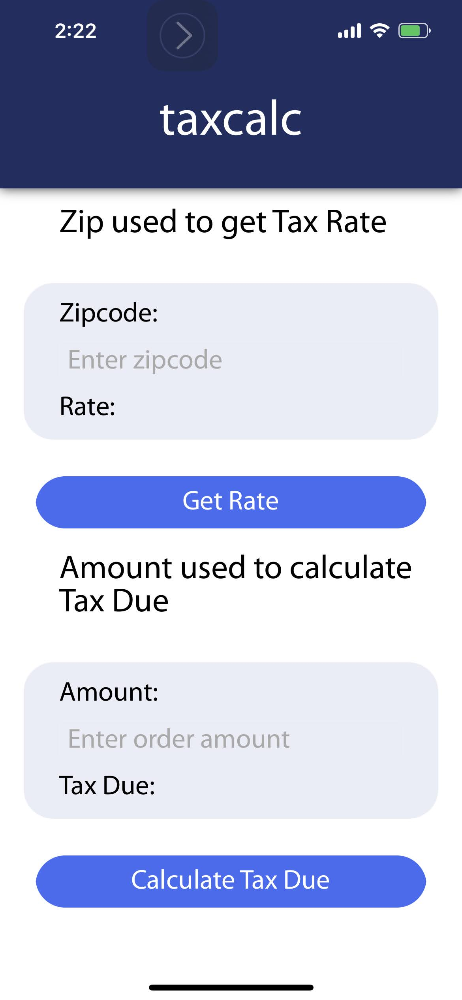
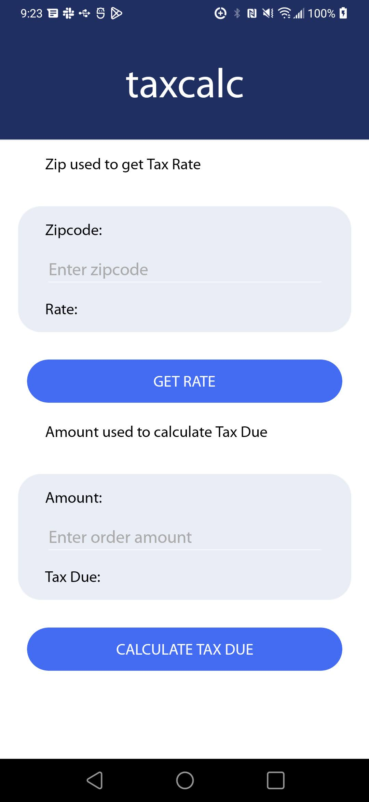

(Orginally written for a job interview)

The keys are not committed:

In taxcalc/Services/TaxCalculators/CalculatorTaxJar.cs, please put in
the API key in the variable:

ServerKey (currently null)

Note: currently this app uses simulated tax service and always returns 0.08 for tax rate.

The GUI supports only 2 inputs:

zip code for displaying the combined tax rate.

total order amount for displaying the calculated tax due for the order.

I've tested the solution on 

M1 Macbook Pro, macOS 12.3.1

XCode 13.3.1

VS Studio 2022 RC 2 (17.0 build 8904)

<table>
  <tr>
    <td>iOS: iPhone 13</td>
    <td>Android: LG G8X ThinQ</td>
  </tr>
  <tr>
    <td>iOS 16.1.1</td>
    <td>Android 10</td>
  </tr>
  <tr>
    <td></td>
    <td></td>
  </tr>
</table>

Note about unit test: Could not test CalculateTaxOfOrder method with bad data.
I keep getting error:
Unit test 'System.Collections.Generic.List`1[System.String]' could not be loaded.

And could not find a solution around it so I did not add it to the unit test.

Note:
Icon's generated by https://easyappicon.com and https://www.appicon.co
Font provided by https://fontsgeek.com/fonts/myriad-pro-regular?ref=readme
